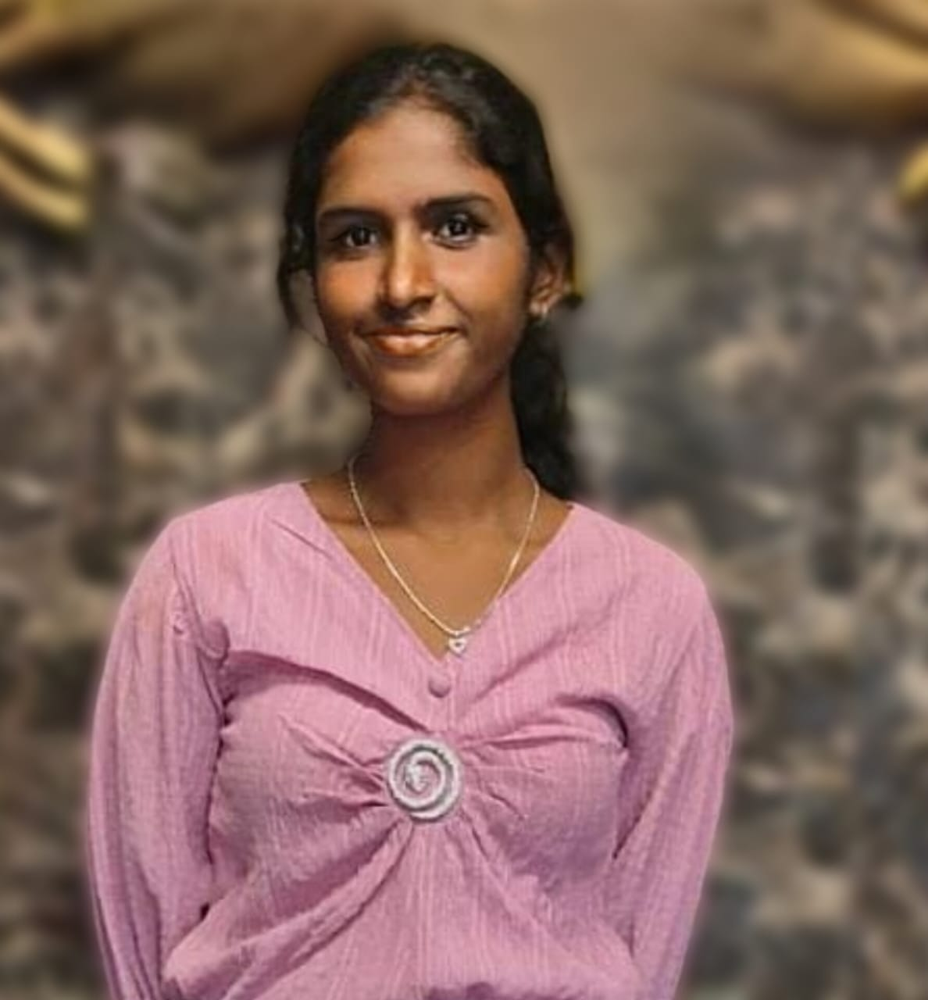

# 👩‍💻 NIROOBHAMAA JAYAPRAKASH  
**AI & Data Science Enthusiast**

📍 Puducherry, India  
📧 niroobhamaa@gmail.com  
🔗 [LinkedIn](https://www.linkedin.com/in/niroobhamaa)  
📞 9345990979  

📍 Puducherry, India  
📧 niroobhamaa@gmail.com  
🔗 [LinkedIn](https://www.linkedin.com/in/niroobhamaa)  
📞 9345990979  

---

## ABOUT ME 

I’m a passionate and curious learner pursuing B.Tech in Computer Science at Manakula Vinayakar Institute of Technology. My interests lie in Data Science, Artificial Intelligence, and Full-Stack Web Development. I'm always eager to apply my knowledge through real-world projects, coding challenges, and hackathons.

---

## SKILLS

**Languages**:  
- Python (Intermediate)  
- Java (Basics)  
- C (Basics)  
- JavaScript  
- HTML & CSS  

**Databases**:  
- MySQL  

**Libraries**:  
- Pandas  
- NumPy  

**Version Control**:  
- Git & GitHub  

**Platforms**:  
- SkillRack  
- Coursera  
- Infosys Springboard  

---

## 🎓 Education

**B.Tech in Computer Science**  
*Manakula Vinayakar Institute of Technology (2023 – 2027)*  

**Higher Secondary**  
*St. Joseph of Cluny Girls H.S.S (2021 – 2023)*  

**Secondary School**  
*St. Joseph of Cluny Girls H.S.S (2019 – 2021)*  

---

## 📜 Certifications

- 📘 *Data Science Fundamentals* – IBM (Coursera)  
- 🐍 *Python for Data Science* – IBM (Coursera)  
- 🧮 *MySQL & SQL Practice* – SkillRack  
- 🧠 *JS Programming* – Infosys Springboard  
- ✅ *Python – Level 1 (All Levels Completed)* – SkillRack  
- 🔥 *Kickstart Challenges* – SkillRack  

---

## 💡 Projects

### ✅ To-Do List Web App  
A simple web app to manage daily tasks — add, delete, and mark tasks as complete.

### ✅ Resume Builder  
A customizable resume generator where users can input and export personal/professional info.

### ✅ Smart Automation System  
A motion-detection-based automation system that controls fan operation intelligently.

---

## 👩‍💻 Hackathons & Tech Events

- 🛠️ **CASTILO Hackathon** – Team participant  
- ⚡ **ELECTROTHON Hackathon** – CIT, Chennai  
- 💡 **TechFest Attendee** – National Conference on Emerging Technologies  

---

## 🌱 Interests

- Artificial Intelligence & Big Data Analytics  
- Data Science & Data Visualization  
- Open Source Contribution  
- Competitive Programming  
- Full-Stack Web Development  
- Exploring Emerging Technologies  

---

> 💬 *“Always eager to learn, build, and contribute — one line of code at a time.”*
